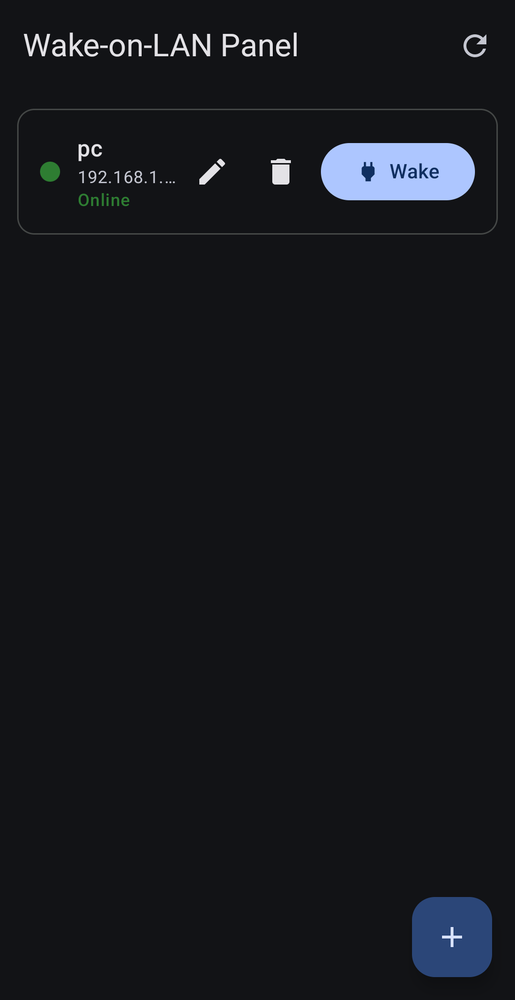
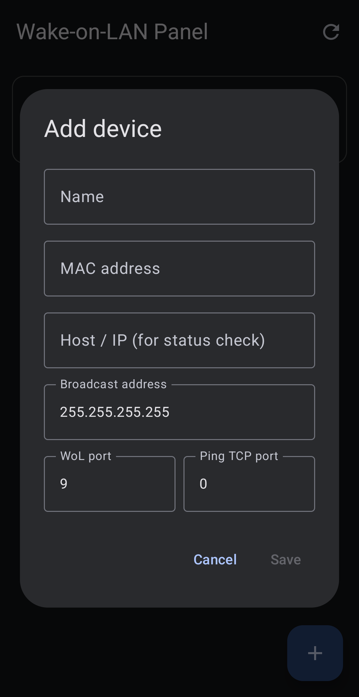

# Wol Panel


A simple Wake-on-LAN panel for Android. Manage your machines and wake them over your LAN.

## Screenshots
<table>
  <tr>
    <td><br><sub>Main Page</sub></td>
    <td><br><sub>Device add page</sub></td>
  </tr>
</table>

## Features

- Device list, saved across restarts
- **Wake** button sends a Wake-on-LAN magic packet
- Online/offline status per device
- Auto-checks status every 15s, plus manual refresh

## Adding a device

Tap **+** and fill in:

- **Name** - any label
- **MAC address** - e.g. `AA:BB:CC:DD:EE:FF`
- **Host / IP** - used for the status check, e.g. `192.168.1.50`
- **Broadcast address** - e.g. `192.168.1.255`
- **WoL port** - usually `9`
- **Ping TCP port** - an open port for accurate status (e.g. `22`, `80`, `3389`)

## Build

Open in Android Studio and press Run, or:

```
./gradlew :app:assembleDebug
```

The APK is written to `app/build/outputs/apk/debug/`.
